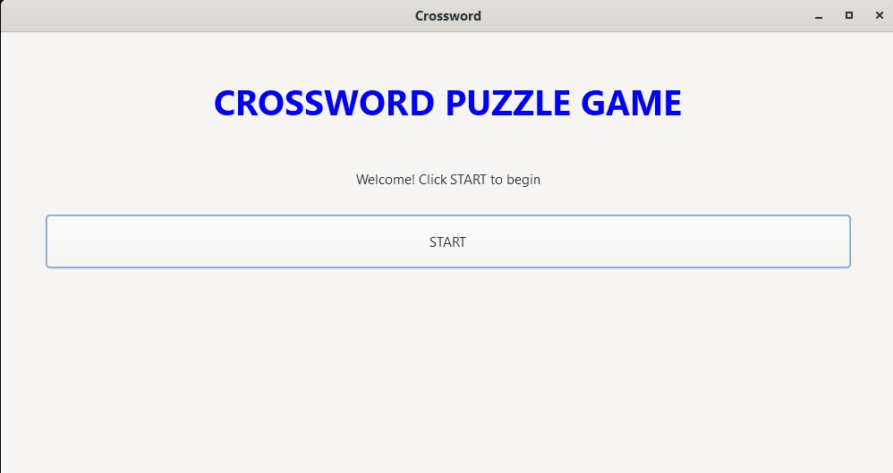

# 🔤 Crossword Puzzle Game


A fully functional crossword puzzle game built in **C with a GTK4 GUI**. Features two roles — Student and Teacher — with real-time crossword generation, hint-based gameplay, a live leaderboard, and a persistent word database.

---

## 📸 Preview
<div align="center">
  <table>
    <tr>
      <td></td>
      <td></td>
    </tr>
    <tr>
      <td></td>
      <td></td>
    </tr>
  </table>
</div>

---

## ✨ Features

- 🎮 **Playable Crossword** — 5 words placed on a 33×33 grid with intersections, both horizontally and vertically
- 💡 **Hint System** — Each word comes with a descriptive hint; solved words are marked with ✓
- ⏱️ **Timed Gameplay** — Tracks completion time and awards points (faster = higher score)
- 🏆 **Leaderboard** — Scores sorted using a min-heap; displays name, time, and points
- 🧑‍🏫 **Teacher Mode** — Password-protected admin panel to add new words and hints to the database
- 🧑‍🎓 **Student Mode** — Play the game or view the score card
- 🗃️ **Persistent Word Database** — Words and hints saved to `crossword_words.txt`, loaded on every startup
- 🌳 **Trie-Based Lookup** — Fast word validation and indexed search using a custom Trie data structure

---

## 🛠️ Tech Stack

| Component | Technology |
|-----------|------------|
| Language | C (C99/C11) |
| GUI Framework | GTK 4 |
| Data Structure | Trie (word lookup & validation) |
| Sorting | Min-Heap (leaderboard) |
| Persistence | Plain text file (`crossword_words.txt`) |
| Randomness | `rand()` seeded with `srand(time(NULL))` |

---

## 📁 Project Structure

```
CrossWord/
│
├── main.c                   # Full source code
├── crossword_words.txt      # Word & hint database (auto-generated if missing)
└── README.md
```

---

## ⚙️ Installation & Build

### Prerequisites

Install GTK4 development libraries:

```bash
# Ubuntu / Debian
sudo apt install libgtk-4-dev gcc

# Fedora
sudo dnf install gtk4-devel gcc

# Arch
sudo pacman -S gtk4 gcc
```

### Build

```bash
gcc main.c -o crossword $(pkg-config --cflags --libs gtk4) -lm
```

### Run

```bash
./crossword
```

---

## 🚀 How to Use

### Student Mode

1. Click **START** → **Student**
2. Click **Play Game**, enter your name, and press **Start Game**
3. A crossword grid appears with 5 hints listed on the right side
4. Type a word in the entry field and press **Enter** or click **Submit**
5. Correct words are revealed on the grid and marked ✓ in the hints list
6. Complete all 5 words to finish — your time and points are recorded
7. Click **View Scores** to see the leaderboard

### Teacher Mode

1. Click **START** → **Teacher**
2. Login with credentials:
   - **Username:** `admin`
   - **Password:** `admin`
3. Click **Add New Word & Hint** to expand the word database
4. New words are immediately saved to `crossword_words.txt`

---

## 📊 How It Works

```
App Start
    │
    ▼
Load crossword_words.txt → WordDatabase (up to 200 words)
    │
    ▼
Player enters name → generateCrossword()
    │
    ├── Place first word horizontally at grid center
    ├── Find letter intersections → place remaining words vertically/horizontally
    └── Fallback: place words in open grid spaces (no intersection required)
    │
    ▼
CopyGrid() → display_grid (filled cells shown as '_' blanks)
    │
    ▼
Player submits word → searchTrie(gameTrie, word)
    │
    ├── Found → updateDisplayGrid() → reveal letters → CompareGrids()
    └── Not found → warning dialog shown
    │
    ▼
All words found → calculate time & points → insert into min-heap leaderboard
```

### Scoring Formula

```
points = 1000 - (completion_time_seconds × 2)
minimum score = 0
```

---

## 📦 Dependencies

| Package | Purpose |
|---------|---------|
| `gtk4` | GUI framework (windows, buttons, grid, dialogs) |
| `glib-2.0` | GTK utility functions (`g_malloc`, `g_free`, signals) |
| `libm` | Math library (linked with `-lm`) |
| Standard C | `stdio`, `stdlib`, `string`, `time`, `stdbool`, `ctype` |

---

## 🐛 Known Issues / Limitations

- Grid generation is randomized — on rare occasions fewer than 5 words may be placed if no letter intersections are found
- The word database file (`crossword_words.txt`) must remain in the same directory as the executable
- Admin credentials are hardcoded (`admin` / `admin`) — not suitable for production use
- Leaderboard resets when the application is closed (scores stored in memory only)

---

## 🔮 Future Improvements

- [ ] Persist leaderboard scores to a file between sessions
- [ ] Allow changing admin password from the Teacher panel
- [ ] Add difficulty levels (short / medium / long word sets)
- [ ] Number grid cells in Across / Down crossword style
- [ ] Show a live countdown timer during gameplay
- [ ] Support deleting words from the database

---

## 👨‍💻 Author

- **Ankit Kumar** — [@Kenk26](https://github.com/Kenk26)
- **Abhay Singh** — [@Abhay0421](https://github.com/Abhay0421)
- **Shresth Dwivedi** — [@ShresthDw](https://github.com/ShresthDw)
